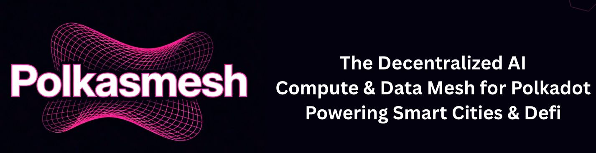
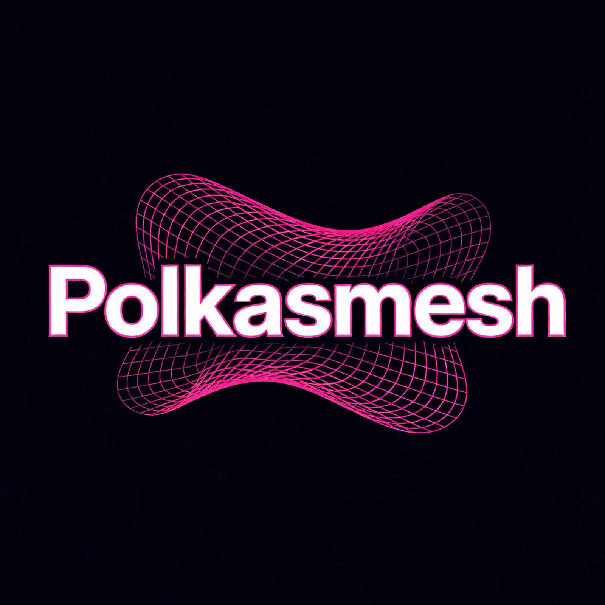

<<<<<<< HEAD
<div align="center">
  
# 🌐 Polkadot AI Mesh





### Decentralized AI Compute Infrastructure for Smart Cities & DeFi

[](https://nextjs.org/)
[](https://www.typescriptlang.org/)
[](https://tailwindcss.com/)
[](LICENSE)

[🚀 Live Demo](https://mesh-polkadot.vercel.app) • [📖 Documentation](#features) • [💬 Community](#community)

</div>

---

## 🎯 Overview

**Polkadot AI Mesh** is a next-generation decentralized AI compute infrastructure built on the Polkadot ecosystem. We bridge the gap between AI computation, Smart City IoT data, and DeFi applications through a privacy-preserving, cross-chain compatible network.

### 🌟 Key Highlights

- **🔒 Privacy-First Computing**: Leverage confidential computing via Phala Network and Acurast
- **🌍 Smart City Integration**: Monetize IoT sensor data through decentralized marketplaces
- **🛡️ MEV Protection**: AI-powered anti-MEV solutions for DeFi traders
- **🔗 Cross-Chain Interoperability**: Seamless XCM integration across all Polkadot parachains
- **⚡ High Performance**: Distributed compute execution with 99.9% uptime

---

## 🏗️ Architecture

The Polkadot AI Mesh operates through four interconnected layers:

### 1️⃣ **Compute Layer**

- **Phala Network**: Confidential smart contracts in TEEs
- **Acurast**: Decentralized serverless compute

### 2️⃣ **Data Layer**

- **Robonomics**: IoT & robotics integration
- **Centrifuge**: Real-world asset tokenization
- **DePIN Networks**: Privacy-preserving data aggregation

### 3️⃣ **Privacy Layer**

- **Zero-Knowledge Proofs**: zkSNARKs for verifiable computation
- **Aleph Zero**: Privacy-enhanced blockchain infrastructure

### 4️⃣ **DeFi Layer**

- **HydraDX**: Cross-chain liquidity provision
- **Polkadex**: MEV-resistant orderbook DEX
- **XCM**: Native Polkadot cross-chain messaging

---

## ✨ Features

### 🔧 For Developers

- TypeScript-first SDK with full type safety
- Pre-built templates for common AI workflows
- Seamless integration with all Polkadot parachains
- Built-in monitoring and analytics dashboard

### 🏙️ For Smart Cities

- Privacy-preserving data marketplace
- Automated revenue sharing via smart contracts
- Real-time traffic, energy, and weather insights
- Interoperable with existing city infrastructure

### 💰 For DeFi Users

- AI-powered transaction routing optimization
- Real-time MEV risk assessment
- Community governance for anti-MEV policies
- Cross-DEX arbitrage protection

---

## 🚀 Getting Started

### Prerequisites

- Node.js 18.x or higher
- npm, yarn, or pnpm

### Installation

```bash
# Clone the repository
git clone https://github.com/PolkaMesh/PolkaMesh_frontend.git
cd PolkaMesh_frontend

# Install dependencies
npm install
# or
yarn install
# or
pnpm install

# Run the development server
npm run dev
# or
yarn dev
# or
pnpm dev
```

Open [http://localhost:3000](http://localhost:3000) in your browser to see the application.

---

## 🛠️ Tech Stack

### Frontend Framework

- **Next.js 16.0** - React framework with App Router
- **TypeScript 5.0** - Type-safe development
- **Tailwind CSS 3.4** - Utility-first CSS framework

### UI & Animation

- **Framer Motion** - Smooth animations and transitions
- **Lucide React** - Beautiful icon library
- **Custom Glass Morphism** - Modern UI effects

### Deployment

- **Vercel** - Seamless deployment and hosting
- **Turbopack** - Ultra-fast build system

---

## 📂 Project Structure

```
PolkaMesh_frontend/
├── app/                    # Next.js App Router
│   ├── layout.tsx         # Root layout with metadata
│   ├── page.tsx           # Homepage
│   └── globals.css        # Global styles and animations
├── components/            # React components
│   ├── Navbar.tsx        # Navigation bar
│   ├── Hero.tsx          # Hero section with animated mesh
│   ├── Features.tsx      # Features showcase
│   ├── ProblemStatement.tsx
│   ├── HowItWorks.tsx
│   ├── Architecture.tsx
│   ├── UseCases.tsx
│   ├── Integrations.tsx
│   ├── Metrics.tsx
│   ├── CTASection.tsx
│   └── Footer.tsx
├── public/               # Static assets
│   ├── meshbanner.jpeg
│   ├── logopolkadot.jpeg
│   └── favicon.ico
└── tailwind.config.js   # Tailwind configuration
```

---

## 🎨 Design Features

- **Dark Theme**: Sleek dark navy background (#0A0A0F) with pink accents
- **Pink Gradient Accents**: Vibrant #E6007A to #FF0080 gradients
- **Animated Wireframe Mesh**: Dynamic network visualization in Hero section
- **Glass Morphism Cards**: Modern frosted glass effect with backdrop blur
- **Glowing Effects**: Subtle pink glow on interactive elements
- **Responsive Design**: Fully optimized for mobile, tablet, and desktop

---

## 🌐 Ecosystem Integrations

<div align="center">

| Parachain         | Function               |
| ----------------- | ---------------------- |
| **Phala Network** | Confidential Computing |
| **Acurast**       | Decentralized Compute  |
| **HydraDX**       | Cross-Chain Liquidity  |
| **Polkadex**      | Orderbook DEX          |
| **Robonomics**    | IoT & Robotics         |
| **Centrifuge**    | Real-World Assets      |

</div>

---

## 📊 Network Metrics

- **100+ Compute Nodes** across 25+ countries
- **15 Parachain Integrations** for seamless interoperability
- **99.9% Uptime** with distributed node architecture
- **75% Energy Savings** vs traditional cloud providers

---

## 🤝 Contributing

We welcome contributions from the community! Please read our [Contributing Guidelines](CONTRIBUTING.md) before submitting a pull request.

### Development Workflow

1. Fork the repository
2. Create a feature branch (`git checkout -b feature/amazing-feature`)
3. Commit your changes (`git commit -m 'Add amazing feature'`)
4. Push to the branch (`git push origin feature/amazing-feature`)
5. Open a Pull Request

---

## 📝 License

This project is licensed under the MIT License - see the [LICENSE](LICENSE) file for details.

---

## 🔗 Links

- **Website**: [https://mesh-polkadot.vercel.app](https://mesh-polkadot.vercel.app)
- **GitHub**: [https://github.com/PolkaMesh/PolkaMesh_frontend](https://github.com/PolkaMesh/PolkaMesh_frontend)
- **Documentation**: Coming Soon
- **Twitter**: [@PolkaMesh](https://twitter.com/PolkaMesh)
- **Discord**: [Join our community](https://discord.gg/polkamesh)

---

## 🙏 Acknowledgments

Built with ❤️ on the **Polkadot** ecosystem

Special thanks to:

- Polkadot & Substrate teams
- Phala Network & Acurast for compute infrastructure
- HydraDX & Polkadex for DeFi integrations
- All parachain partners

---

<div align="center">

### 🌟 Star us on GitHub — it motivates us a lot!

Made with 💖 by the PolkaMesh Team

</div>
